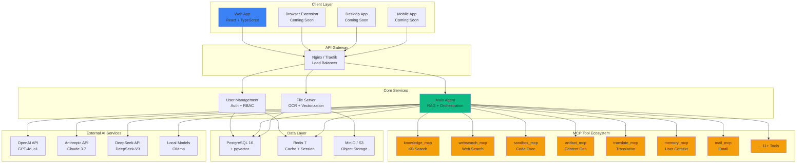
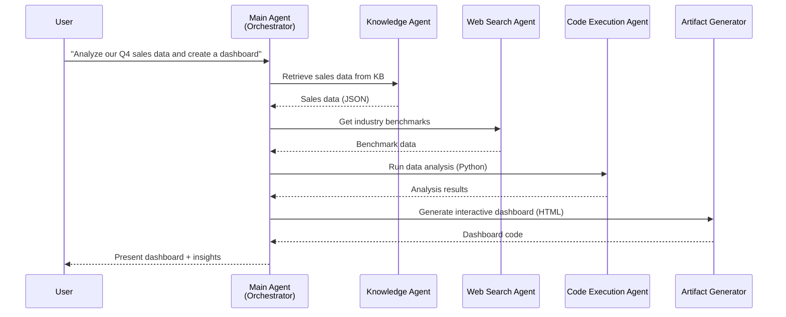
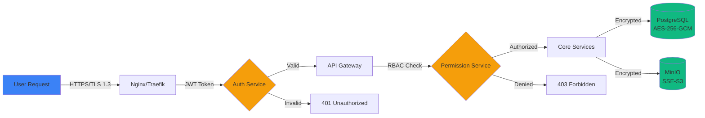

<div align="center">


# OpenMonica

### 🤖 Open-Source AI Copilot & Personal Agent Platform

**Monica的开源替代品 | 企业级私有化部署 | Multi-Agent协作系统**

[](LICENSE)
[](https://www.python.org/downloads/)
[](https://www.typescriptlang.org/)
[](https://www.postgresql.org/)
[](https://www.docker.com/)
[](https://github.com/yourusername/OpenMonica)

[English](README.md) | [简体中文](README_zh-CN.md) | [Documentation](https://docs.openmonica.io) | [Demo](https://demo.openmonica.io) | [Discord](https://discord.gg/openmonica)

**🚀 Your Personal AI Agent, Fully Under Your Control**

</div>

---

## 🌟 What is OpenMonica?

**OpenMonica** is an **open-source AI copilot and personal agent platform**, built as a privacy-first, self-hosted alternative to [Monica AI](https://monica.im). Unlike cloud-based AI assistants that store your data on third-party servers, OpenMonica empowers **organizations and teams** to deploy their own AI agent infrastructure with complete data sovereignty.

Think of it as **Monica + Manus AI**, but:
- ✅ **100% Open Source** - Full transparency, community-driven development
- ✅ **Self-Hosted** - Deploy on your own infrastructure (cloud or on-premise)
- ✅ **Privacy-First** - Your data never leaves your servers
- ✅ **Enterprise-Ready** - Multi-user support for teams and organizations
- ✅ **Extensible** - MCP-based tool ecosystem with 11+ built-in agents
- ✅ **Cost-Effective** - No per-user subscription fees, pay only for infrastructure

### 🎯 Core Capabilities

OpenMonica is not just a knowledge base or chatbot—it's a **general-purpose AI agent** that can autonomously execute complex tasks across multiple domains:

| Capability | Description | Powered By |
|------------|-------------|------------|
| 💬 **Chat** | Multi-model conversations (GPT-4o, Claude 3.7, DeepSeek, Qwen, etc.) | LLM Router + Load Balancer |
| 🔍 **Search** | Real-time web search with cited sources | `websearch_mcp` (Tavily API) |
| 📖 **Read** | Document understanding, OCR, PDF/image analysis | MinerU + Mistral Vision + RAG |
| ✍️ **Write** | Content generation, articles, reports, creative writing | `artifact_mcp` + LLM |
| 💻 **Code** | Execute Python/JavaScript/Bash, debug code, build apps | `sandbox_mcp` (E2B runtime) |
| 🌍 **Translate** | Multi-language translation and localization | `translate_mcp` |
| 🎨 **Create** | Generate images, videos, diagrams, charts | `text2image_mcp`, `text2video_mcp` |
| 📧 **Assist** | Email management, calendar scheduling, task automation | `mail_mcp` |
| 🧠 **Remember** | Learn user preferences, context-aware personalization | `memory_mcp` + Vector DB |
| 🤔 **Reason** | Multi-step reasoning, complex problem-solving | `sequentialthinking_mcp` |
| 📊 **Analyze** | Data analysis, visualization, knowledge graphs | RAG + Graph DB |

---

## 🆚 OpenMonica vs Monica AI

| Feature | Monica AI | OpenMonica |
|---------|-----------|------------|
| **Deployment Model** | ☁️ Cloud SaaS (monica.im) | 🏠 Self-Hosted / Private Cloud |
| **Data Privacy** | Stored on Monica's servers | 🔒 100% on your infrastructure |
| **Pricing** | $9.9 - $28.99/month per user | ✅ Open-source, pay only for compute |
| **Customization** | Limited to predefined bots | 🔧 Fully customizable agents & tools |
| **Knowledge Base** | Personal notes & documents | 🏢 Enterprise knowledge systems + RAG |
| **Multi-User Support** | Personal use only | 👥 Team/Organization accounts |
| **Tool Ecosystem** | Closed, proprietary plugins | 🔌 MCP-based, 100% open & extensible |
| **LLM Support** | Managed by Monica | 🎛️ BYO API keys, self-hosted models (Ollama) |
| **On-Premise Deployment** | ❌ Not available | ✅ Fully supported (Docker/K8s) |
| **Source Code Access** | ❌ Closed source | ✅ MIT License, community-driven |

---

## 🏗️ Architecture Overview

OpenMonica is built on a **microservices architecture** with a **multi-agent collaboration system** at its core. Each service is independently scalable and fault-tolerant.



### 🧩 Multi-Agent Collaboration

OpenMonica uses **Model Context Protocol (MCP)** to orchestrate multiple specialized agents that collaborate to solve complex tasks:



---

## ✨ Key Features

### 🎯 For Individual Users

- **Personal AI Assistant**: Chat with multiple LLMs in one interface (GPT-4, Claude, DeepSeek, etc.)
- **Knowledge Base**: Upload documents (PDF, Word, images) and ask questions with RAG-powered answers
- **Web Browsing**: Get real-time information from the internet with cited sources
- **Code Execution**: Write and run Python/JavaScript code in a secure sandbox environment
- **Content Creation**: Generate articles, images, diagrams, and more
- **Multi-Language Support**: Translate content and chat in 100+ languages
- **Privacy**: All your data stays on your own servers

### 🏢 For Organizations & Teams

- **Multi-User Management**: Create accounts for team members with role-based access control (RBAC)
- **Shared Knowledge Bases**: Build organization-wide knowledge repositories
- **Custom Agents**: Configure specialized agents for different departments (HR, Sales, Engineering, etc.)
- **Admin Dashboard**: Monitor usage, costs, and agent performance
- **SSO Integration**: Connect with existing identity providers (LDAP, OAuth, SAML)
- **Audit Logging**: Track all agent interactions for compliance and security
- **Resource Isolation**: Per-user/per-team resource limits and quotas

### 🛠️ For Developers

- **MCP Tool Ecosystem**: Extend OpenMonica with custom tools using the Model Context Protocol
- **API-First Design**: RESTful APIs for all services with OpenAPI documentation
- **Webhook Support**: Integrate with external systems (Slack, Discord, GitHub, etc.)
- **Plugin Development**: Build custom agents and connectors
- **Local LLM Support**: Run with self-hosted models (Ollama, vLLM, LM Studio)
- **Observability**: Prometheus metrics, OpenTelemetry tracing, structured logging

---

## 🚀 Quick Start

### Prerequisites

- Docker 24+ and Docker Compose 2.20+
- 8GB+ RAM (16GB recommended for production)
- PostgreSQL 16+ (or use the included Docker setup)
- Redis 7+ (or use the included Docker setup)
- API keys for LLMs (OpenAI, Anthropic, DeepSeek, etc.) OR Ollama for local models

### 1. Clone the Repository

```bash
git clone --recurse-submodules https://github.com/yourusername/OpenMonica.git
cd OpenMonica
```

### 2. Configure Environment Variables

```bash
# Copy example configs
cp .env.example .env
cp modules/OpenMonica_UserManagement/.env.example modules/OpenMonica_UserManagement/.env
cp modules/OpenMonica_main/.env.example modules/OpenMonica_main/.env
cp modules/OpenMonica_fileserver/.env.example modules/OpenMonica_fileserver/.env

# Edit .env files with your settings:
# - Database credentials
# - Redis connection
# - MinIO/S3 settings
# - LLM API keys (OpenAI, Anthropic, DeepSeek, etc.)
# - JWT secret for authentication
```

### 3. Launch with Docker Compose

```bash
# Start all services
docker-compose up -d

# Check service health
docker-compose ps

# View logs
docker-compose logs -f
```

### 4. Access OpenMonica

- **Web App**: http://localhost:3000
- **API Documentation**: http://localhost:8000/docs
- **Admin Panel**: http://localhost:3000/admin

**Default Credentials** (change immediately!):
- Username: `admin`
- Password: `admin123`

### 5. Create Your First Agent

1. Navigate to **Settings** → **Agents**
2. Click **Create New Agent**
3. Configure:
   - Name: "Sales Assistant"
   - Description: "Helps with sales data analysis and reporting"
   - Tools: Enable `knowledge_mcp`, `websearch_mcp`, `sandbox_mcp`
   - Knowledge Bases: Link to "Sales Documents" KB
4. Start chatting with your agent!

---

## 📦 Installation Methods

### Option 1: Docker Compose (Recommended)

See [Quick Start](#-quick-start) above.

### Option 2: Kubernetes Deployment

For production deployments with high availability and auto-scaling:

```bash
# Install with Helm
helm repo add openmonica https://charts.openmonica.io
helm install openmonica openmonica/openmonica \
  --namespace openmonica \
  --create-namespace \
  --values values-production.yaml
```

See [Kubernetes Deployment Guide](docs/deployment/kubernetes.md) for details.

### Option 3: Manual Installation

For development or custom deployments:

```bash
# 1. Install PostgreSQL 16+ with pgvector
sudo apt install postgresql-16 postgresql-16-pgvector

# 2. Install Redis 7+
sudo apt install redis-server

# 3. Install Python 3.11+ and dependencies
cd modules/OpenMonica_UserManagement
pip install -e .

cd ../OpenMonica_main
pip install -e .

cd ../OpenMonica_fileserver
pip install -e .

# 4. Install Node.js 20+ and build frontend
cd ../OpenMonica_frontend
npm install
npm run build

# 5. Configure and start services
# See detailed instructions in docs/deployment/manual.md
```

---

## 🔧 Configuration

### LLM Providers

OpenMonica supports multiple LLM providers out of the box:

| Provider | Models | API Key Required | Self-Hosted Option |
|----------|--------|------------------|---------------------|
| **OpenAI** | GPT-4o, GPT-4 Turbo, GPT-3.5 Turbo | ✅ Yes | ❌ No |
| **Anthropic** | Claude 3.7 Sonnet, Claude 3.5 Haiku | ✅ Yes | ❌ No |
| **DeepSeek** | DeepSeek-V3, DeepSeek-Coder | ✅ Yes | ❌ No |
| **Google** | Gemini 1.5 Pro, Gemini 2.0 Flash | ✅ Yes | ❌ No |
| **Ollama** | Llama 3, Mistral, Qwen, etc. | ❌ No | ✅ Yes |
| **vLLM** | Any HuggingFace model | ❌ No | ✅ Yes |

Configure in `modules/OpenMonica_main/.env`:

```env
# OpenAI
OPENAI_API_KEY=sk-...
OPENAI_BASE_URL=https://api.openai.com/v1

# Anthropic
ANTHROPIC_API_KEY=sk-ant-...

# DeepSeek
DEEPSEEK_API_KEY=sk-...
DEEPSEEK_BASE_URL=https://api.deepseek.com

# Ollama (local)
OLLAMA_BASE_URL=http://localhost:11434
OLLAMA_MODEL=llama3:70b
```

### MCP Tools Configuration

Enable or disable specific tools in `modules/OpenMonica_main/config/tools.yaml`:

```yaml
tools:
  knowledge_mcp:
    enabled: true
    priority: high
  websearch_mcp:
    enabled: true
    api_key: ${TAVILY_API_KEY}
  sandbox_mcp:
    enabled: true
    timeout: 300
  mail_mcp:
    enabled: false  # Disable if not needed
```

### Knowledge Base Settings

Configure OCR and vectorization in `modules/OpenMonica_fileserver/.env`:

```env
# OCR Engine
OCR_ENGINE=mineru  # Options: mineru, mistral_vision, tesseract
OCR_LANGUAGE=eng,chi_sim

# Vector Embedding Model
EMBEDDING_MODEL=bge-m3  # Options: bge-m3, voyage-ai, openai
EMBEDDING_DIMENSION=1024

# Chunk Settings
CHUNK_SIZE=512
CHUNK_OVERLAP=50
```

---

## 📚 Use Cases

### 1️⃣ Personal Productivity Assistant

**Scenario**: Freelance consultant managing multiple clients

**Setup**:
- Create separate knowledge bases for each client
- Enable `mail_mcp` for email management
- Enable `translate_mcp` for international clients
- Enable `memory_mcp` to remember client preferences

**Result**: AI assistant that:
- Summarizes client emails and suggests responses
- Answers questions about past projects using client documents
- Translates communications with non-English clients
- Remembers each client's communication style and preferences

### 2️⃣ Enterprise Knowledge Hub

**Scenario**: 500-person tech company with scattered documentation

**Setup**:
- Deploy OpenMonica on company Kubernetes cluster
- Create knowledge bases:
  - `engineering-docs` (technical specs, architecture docs)
  - `hr-policies` (employee handbook, benefits)
  - `sales-materials` (pitch decks, case studies)
- Configure RBAC: Engineers → `engineering-docs`, Everyone → `hr-policies`, Sales → `sales-materials`

**Result**:
- Employees get instant answers from company knowledge base
- Reduces support tickets to HR and IT by 40%
- New hires onboard 2x faster with AI-guided documentation

### 3️⃣ Research & Data Analysis

**Scenario**: Academic research team analyzing papers and datasets

**Setup**:
- Upload research papers to knowledge base (PDF OCR)
- Enable `websearch_mcp` for latest papers from arXiv
- Enable `sandbox_mcp` for running data analysis code
- Enable `artifact_mcp` for generating visualizations

**Result**: AI agent that:
- Summarizes research papers and extracts key findings
- Finds related papers from the web
- Runs statistical analysis on datasets
- Generates charts and diagrams for presentations

### 4️⃣ Customer Support Automation

**Scenario**: SaaS company with knowledge base of support articles

**Setup**:
- Import support docs and FAQs into knowledge base
- Create custom agent with `knowledge_mcp` + `mail_mcp`
- Integrate with customer support email (forwarding rules)

**Result**:
- AI drafts responses to common support questions
- Human agents review and send (HITL - human-in-the-loop)
- Response time reduced from 4 hours to 15 minutes
- Support team focuses on complex issues

---

## 🛣️ Roadmap

### ✅ Version 0.1.0 (Current - Q1 2025)

- [x] Core RAG engine with multi-model support
- [x] User management and authentication
- [x] File upload, OCR, and vectorization
- [x] 11 MCP tool servers (knowledge, websearch, sandbox, etc.)
- [x] Web application (React + TypeScript)
- [x] Docker Compose deployment
- [x] Basic admin dashboard

### 🚧 Version 0.2.0 (Q2 2025)

- [ ] **Browser Extension** (Chrome, Firefox, Edge)
  - Chat anywhere on the web (like Monica)
  - Summarize web pages
  - Translate selected text
  - Quick AI commands with keyboard shortcuts
- [ ] **Enhanced Knowledge Graph** (Neo4j integration)
- [ ] **Voice Interaction** (Speech-to-text, text-to-speech)
- [ ] **Advanced Analytics Dashboard** (usage stats, cost tracking)
- [ ] **SSO Integration** (OAuth 2.0, SAML 2.0, LDAP)

### 🔮 Version 0.3.0 (Q3 2025)

- [ ] **Desktop Application** (Windows, macOS, Linux via Electron)
  - System tray integration
  - Hotkey activation (Cmd+Shift+Space)
  - Offline mode with local LLMs
- [ ] **Mobile Apps** (iOS, Android via React Native)
- [ ] **Team Collaboration Features**
  - Shared chat threads
  - @mentions and notifications
  - Team knowledge bases
- [ ] **Workflow Automation** (Zapier-like automation builder)

### 🌟 Version 0.4.0 (Q4 2025)

- [ ] **Multi-Modal Enhancements**
  - Image understanding (vision models)
  - Audio processing (transcription, analysis)
  - Video summarization
- [ ] **Advanced Agent Capabilities**
  - Reinforcement learning (OpenManus-RL style)
  - Long-term memory and context
  - Goal-oriented task execution
- [ ] **Enterprise Features**
  - Usage quotas and billing
  - Department-level isolation
  - Compliance reports (GDPR, HIPAA)

### 🎯 Version 1.0.0 (Q1 2026)

- [ ] **Production-Ready Release**
  - 99.9% uptime SLA
  - Multi-region deployment support
  - Auto-scaling and load balancing
  - Comprehensive security audit
- [ ] **Marketplace**
  - Community-built agents and tools
  - One-click installation of plugins
  - Revenue sharing for developers
- [ ] **AI Model Fine-Tuning**
  - Fine-tune models on organization data
  - Custom embeddings for domain-specific KB

---

## 🏛️ Architecture Details

### Technology Stack

| Layer | Technology | Purpose |
|-------|------------|---------|
| **Frontend** | React 18 + TypeScript 5.7 | Modern, type-safe UI |
| **Build Tool** | Vite 6.0 | Lightning-fast development |
| **UI Library** | Ant Design 5 + Tailwind CSS | Beautiful, responsive components |
| **State Management** | Zustand 4.5 | Lightweight, performant state |
| **Backend** | Python 3.11+ (FastAPI, Starlette) | Async, high-performance APIs |
| **Database** | PostgreSQL 16 + pgvector 0.7 | Relational data + vector search |
| **Cache** | Redis 7 | Session management, rate limiting |
| **Object Storage** | MinIO / AWS S3 | Document and media storage |
| **Message Queue** | Redis Streams / RabbitMQ | Async task processing |
| **Orchestration** | Docker Compose / Kubernetes | Container management |
| **Observability** | Prometheus + Grafana + Loki | Metrics, logs, tracing |

### Security Architecture



**Security Features**:
- 🔐 **Authentication**: JWT tokens with refresh mechanism, bcrypt password hashing (10 rounds)
- 🛡️ **Authorization**: RBAC (Role-Based Access Control) + ABAC (Attribute-Based Access Control)
- 🔒 **Encryption**:
  - At-rest: AES-256-GCM for database and object storage
  - In-transit: TLS 1.3 for all HTTP communications
- 🚨 **Security Headers**: CSP, HSTS, X-Frame-Options, X-Content-Type-Options
- 📝 **Audit Logging**: All user actions and agent interactions logged
- 🕵️ **Intrusion Detection**: Rate limiting, IP whitelisting, anomaly detection

### Observability Stack

```yaml
# Prometheus metrics
- http_request_duration_seconds (API latency)
- rag_query_latency_seconds (RAG pipeline performance)
- llm_token_usage_total (LLM cost tracking)
- vector_search_results_count (search quality)

# Grafana dashboards
- System Overview (CPU, memory, disk)
- API Performance (requests/sec, error rates)
- LLM Usage & Costs (tokens, API calls, $$$)
- User Activity (active users, chat sessions)

# Loki log aggregation
- Structured JSON logs from all services
- Query by user_id, session_id, trace_id
- Alert on errors and anomalies
```

---

## 🧪 Performance Benchmarks

### Vector Search Performance

Tested on PostgreSQL 16 with pgvector 0.7.4, 10M vectors (1024 dimensions):

| Operation | Latency (p50) | Latency (p99) | Throughput |
|-----------|---------------|---------------|------------|
| **Vector Search** (Top 10) | 23ms | 48ms | 1,200 QPS |
| **Hybrid Search** (Vector + Full-text) | 35ms | 67ms | 850 QPS |
| **Document Retrieval** | 15ms | 28ms | 2,000 QPS |

**Configuration**: 8-core CPU, 32GB RAM, NVMe SSD, `ivfflat` index with 100 lists.

### LLM Inference Performance

| Provider | Model | Latency (TTFT)* | Throughput (tokens/s) | Cost (per 1M tokens) |
|----------|-------|-----------------|------------------------|----------------------|
| **OpenAI** | GPT-4o | 450ms | 120 | $2.50 / $10.00 |
| **Anthropic** | Claude 3.7 Sonnet | 380ms | 150 | $3.00 / $15.00 |
| **DeepSeek** | DeepSeek-V3 | 320ms | 180 | $0.27 / $1.10 |
| **Ollama (Local)** | Llama 3 70B | 800ms | 35 | $0 (self-hosted) |

*TTFT = Time To First Token

### Document Processing Performance

Tested on 8-core CPU, 16GB RAM:

| Document Type | Pages/Files | Processing Time | Throughput |
|---------------|-------------|-----------------|------------|
| **PDF (Text)** | 100 pages | 45 seconds | 133 pages/min |
| **PDF (Scanned - OCR)** | 100 pages | 8 minutes | 12.5 pages/min |
| **Word Documents** | 500 files | 3 minutes | 166 files/min |
| **Images (OCR)** | 1000 images | 15 minutes | 66 images/min |

---

## 🤝 Contributing

We welcome contributions from the community! OpenMonica is built by developers, for developers.

### Ways to Contribute

- 🐛 **Report Bugs**: Open an issue on [GitHub Issues](https://github.com/yourusername/OpenMonica/issues)
- 💡 **Feature Requests**: Share your ideas in [Discussions](https://github.com/yourusername/OpenMonica/discussions)
- 📝 **Documentation**: Improve guides, tutorials, and API docs
- 🔧 **Code Contributions**: Submit pull requests (see [CONTRIBUTING.md](CONTRIBUTING.md))
- 🌐 **Translations**: Help translate OpenMonica into your language
- 🧩 **Build Tools**: Create MCP tools and share with the community

### Development Setup

```bash
# 1. Fork and clone the repository
git clone --recurse-submodules https://github.com/yourusername/OpenMonica.git
cd OpenMonica

# 2. Create a feature branch
git checkout -b feature/my-awesome-feature

# 3. Set up development environment
docker-compose -f docker-compose.dev.yml up -d

# 4. Install dependencies
cd modules/OpenMonica_main
pip install -e ".[dev]"  # Includes pytest, black, mypy

cd ../OpenMonica_frontend
npm install

# 5. Run tests
pytest
npm run test

# 6. Make your changes and commit
git add .
git commit -m "feat: add awesome feature"

# 7. Push and create PR
git push origin feature/my-awesome-feature
```

### Code Standards

- **Python**: Follow PEP 8, use `black` for formatting, `mypy` for type checking
- **TypeScript**: Follow Airbnb style guide, use Prettier for formatting
- **Commits**: Use [Conventional Commits](https://www.conventionalcommits.org/) format
- **Tests**: Maintain >80% code coverage
- **Documentation**: Update docs for any user-facing changes

---

## 📖 Documentation

- **[Quick Start Guide](docs/quickstart.md)** - Get up and running in 5 minutes
- **[Architecture Overview](docs/architecture.md)** - System design and components
- **[API Reference](docs/api/README.md)** - RESTful API documentation
- **[MCP Tool Development](docs/mcp-tools.md)** - Build custom agents and tools
- **[Deployment Guide](docs/deployment/README.md)** - Docker, Kubernetes, manual installation
- **[Configuration](docs/configuration.md)** - Environment variables and settings
- **[Troubleshooting](docs/troubleshooting.md)** - Common issues and solutions
- **[FAQ](docs/faq.md)** - Frequently asked questions

### Module-Specific Documentation

- **[User Management Service](modules/OpenMonica_UserManagement/README.md)** - Authentication, RBAC, user APIs
- **[Main Agent Service](modules/OpenMonica_main/README.md)** - RAG engine, MCP orchestration, LLM integration
- **[File Server Service](modules/OpenMonica_fileserver/README.md)** - OCR, vectorization, storage management
- **[Frontend Application](modules/OpenMonica_frontend/README.md)** - React app, UI components, state management

---

## 🌐 Community & Support

### Community Channels

- **💬 Discord**: Join our [Discord server](https://discord.gg/openmonica) for real-time chat
- **💭 GitHub Discussions**: [Ask questions and share ideas](https://github.com/yourusername/OpenMonica/discussions)
- **🐦 Twitter/X**: Follow [@OpenMonica](https://twitter.com/OpenMonica) for updates
- **📧 Mailing List**: Subscribe to [announce@openmonica.io](mailto:announce@openmonica.io)

### Getting Help

1. **Check the Documentation**: Most questions are answered in [docs](docs/)
2. **Search Existing Issues**: Someone may have already reported your issue
3. **Ask in Discord**: Get help from the community in real-time
4. **Open a Discussion**: For open-ended questions or feature ideas
5. **File an Issue**: For confirmed bugs or feature requests

### Commercial Support

For organizations requiring:
- Dedicated support (SLA-backed)
- Custom feature development
- Training and onboarding
- Consulting and architecture review

Contact us at: **enterprise@openmonica.io**

---

## 📜 License

OpenMonica is licensed under the **MIT License** - see the [LICENSE](LICENSE) file for details.

```
MIT License

Copyright (c) 2025 OpenMonica Contributors

Permission is hereby granted, free of charge, to any person obtaining a copy
of this software and associated documentation files (the "Software"), to deal
in the Software without restriction, including without limitation the rights
to use, copy, modify, merge, publish, distribute, sublicense, and/or sell
copies of the Software...
```

**What this means**:
- ✅ Free to use for commercial and non-commercial purposes
- ✅ Modify and distribute as you wish
- ✅ No attribution required (but appreciated!)
- ❌ No warranty or liability from the authors

---

## 🙏 Acknowledgments

OpenMonica stands on the shoulders of giants. We're grateful to:

- **[Monica AI](https://monica.im)** - Inspiration for the personal AI assistant concept
- **[OpenManus](https://github.com/FoundationAgents/OpenManus)** - Pioneering open-source AI agents
- **[MetaGPT](https://github.com/geekan/MetaGPT)** - Multi-agent collaboration research
- **[LangChain](https://github.com/langchain-ai/langchain)** - RAG and LLM tooling
- **[FastAPI](https://fastapi.tiangolo.com/)** - High-performance Python web framework
- **[React](https://react.dev/)** - Powering the frontend
- **[PostgreSQL](https://www.postgresql.org/)** - Reliable, powerful database
- **[pgvector](https://github.com/pgvector/pgvector)** - Vector similarity search for Postgres

And to all our [contributors](https://github.com/yourusername/OpenMonica/graphs/contributors) who make this project possible! 🎉

---

## 📊 Star History

[](https://star-history.com/#yourusername/OpenMonica&Date)

---

<div align="center">

**Built with ❤️ by the OpenMonica community**

[⬆ Back to Top](#openmonica)

</div>
